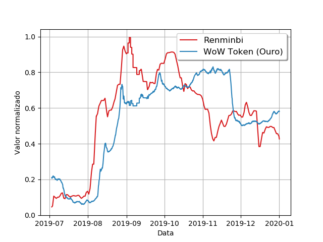
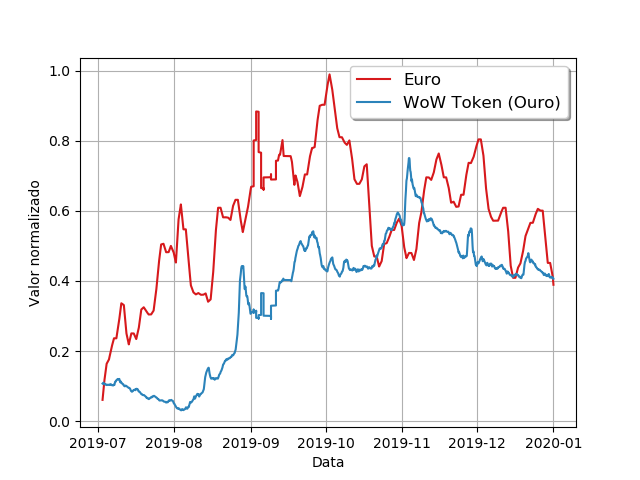
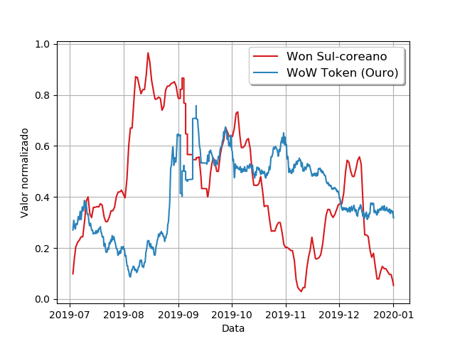
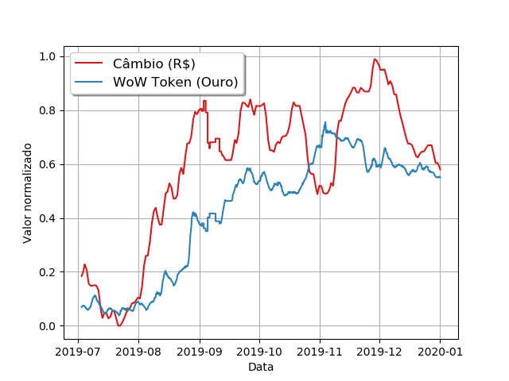

# Files

Here you can find all files used for documentation.

### Files

- : The full article of the project;

- [plot_ch_rmb.png](plot_ch_rmb.png): Graph about China's wowtoken value and Reminbi currency;

- [plot_eu_eur.png](plot_eu_eur.png): Graph about Europe's wowtoken value and Euro currency;

- [plot_kr_krw.png](plot_kr_krw.png): Graph about Korea's wowtoken value and Won South-Korean currency;

- [plot_us_brl.png](plot_us_brl.png): Graph about America's wowtoken value and Real Brasileiro currency;

